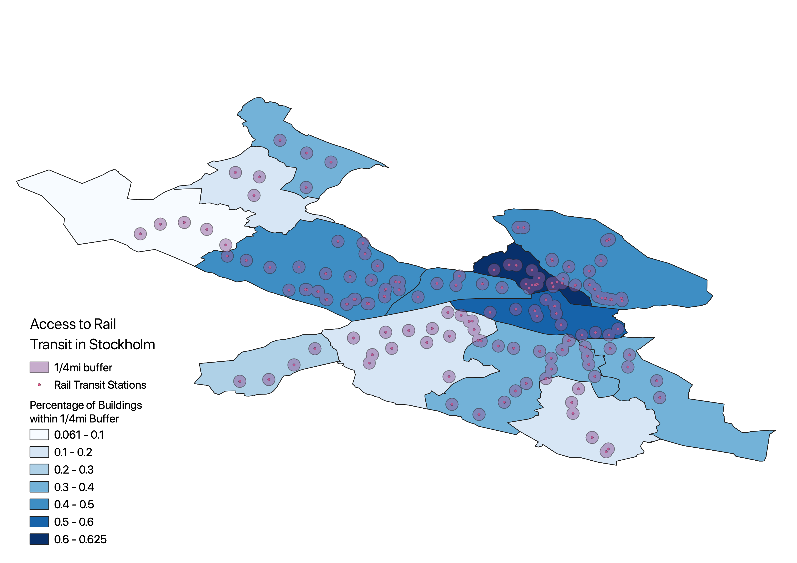
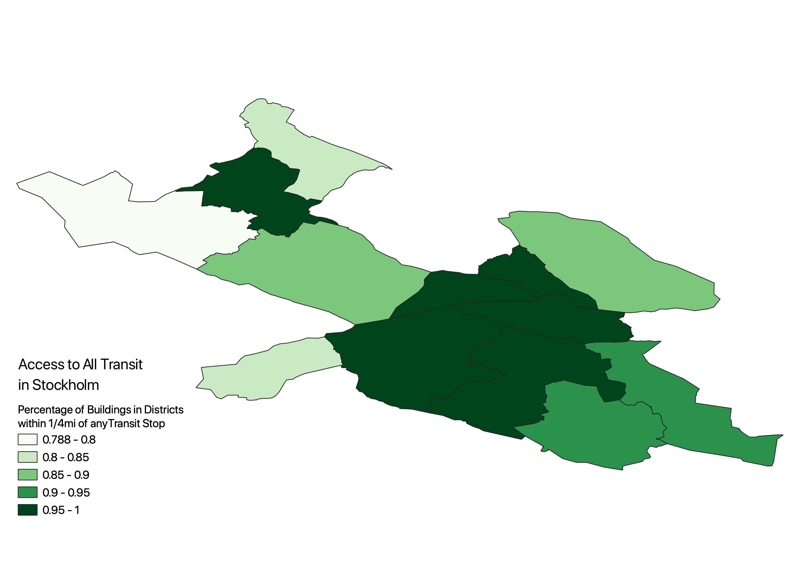

## Background

Unlike other analyses on this page, conducted as a part of [Prof. Joe Holler's](https://josephholler.github.io/) spring 2021 class "Open Source GIScience," this analysis is a personal project used for part of a project for another class, as well as practice and personal enjoyment of PostGIS and SQL.

This analysis aims to quantify access to public transportation in Stockholm, Sweden with easily available, open source data, all as part of a project looking at Stockholm as a successful urban environment. By taking advantage of the large number of features available to query in [OpenStreetMap](https://www.openstreetmap.org/#map=13/39.9209/-75.1324&layers=T), one is able to conduct a

## Accessing data

All data used in this analysis was queried from OpenStreetMap, with the assistance of [Prof. Joe Holler](https://josephholler.github.io/), querying all features within and near Stockholm. Data can also be loaded independently through the tool osm2pgsql, with instructions available [here](https://derrickburt.github.io/opengis/sql/DSlab/DSLAB.html).

## Analysis

The entire script for this analysis is available [here](evankilli/Personal/Stockholm_transit/stockholm.sql).

Like my earlier analysis of access to medical care in Dar-es-Salaam, this workflow was modeled in part by the work of Derrick Burt and his similar analysis of access to public transportation in Dar-es-Salaam, also using OpenStreetMap and Resilience Academy data. His analysis is linked [here](https://derrickburt.github.io/opengis/sql/DSlab/DSLAB.html)

<p align="center">
 
  </p>

### 1) Isolate Stockholms kommun

```sql
create table sholm as
  select osm_id, name, way as geom
  from se_polygon
  where admin_level = '7' and name = 'Stockholms kommun'
-- we need to make sure we're only looking at Stockholm and not adjacent suburbs
```

### 2) Isolate residences for analysis

```sql
create table res_osm as
select osm_id, building, way as geom
from se_polygon
where building = 'yes' or building = 'residential'
-- select residences and unclassified buildings. Some mixed use buildings in dense areas are unclassified, and classification of buildings in particular on OpenStreetMap is imperfect, so a decision was made to err on the side of too many rather than too few residences

alter table res_osm
add column within_sholm INTEGER
-- create column so we can set at 1 when within city

update res_osm
  set within_sholm = 1
  from sholm
  where st_within(res_osm.geom, sholm.geom)
-- give value of 1 where within Stockholm

select within_sholm, count(osm_id)
from res_osm
group by within_sholm
-- check

delete from res_osm
  where within_sholm is null
-- only Stockholm now!
```

### 3) Isolate transit stops

```sql
/* First, just rail transit (metro, trams, light rail, commuter trains) */
create table sholm_rail_transit as
select osm_id, name, railway, public_transport, way as geom
from se_point
where railway = 'tram_stop' or railway = 'station'

alter table sholm_rail_transit
add column within_sholm INTEGER
-- create column so we can set at 1 when within city

update sholm_rail_transit
  set within_sholm = 1
  from sholm
  where st_within(sholm_rail_transit.geom, sholm.geom)
  -- give value of 1 where within Stockholm

select within_sholm, count(osm_id)
from sholm_rail_transit
group by within_sholm
-- check

delete from sholm_rail_transit
  where within_sholm is null
-- delete where outside of Stockholm


/* Now we'll look at all of Stockholm's transit options, including buses */
create table sholm_transit as
select osm_id, name, railway, public_transport, highway, way as geom
from se_point
where public_transport = 'stop_position' or public_transport = 'station' or highway = 'bus_stop'
-- repeat process with expanded parameters

alter table sholm_transit
add column within_sholm INTEGER
-- create column so we can set at 1 when within city

update sholm_transit
  set within_sholm = 1
  from sholm
  where st_within(sholm_transit.geom, sholm.geom)
-- give value of 1 where within Stockholm

select within_sholm, count(osm_id)
from sholm_transit
group by within_sholm
-- check

delete from sholm_transit
  where within_sholm is null
-- delete transit stops outside of Stockholm

select railway, count(osm_id)
  from sholm_transit
  group by railway
```

### 4) Isolate Stockholm neighborhoods

```sql
create table sholm_hoods as
select osm_id, name, population, way as geom
from se_polygon
where admin_level = '9'
except
select osm_id, name, population, way as geom
from se_polygon
where name = 'Gustavsberg'
-- Gustavsberg was the only borough/Stadsdelsområde outside of Stockholm which showed up when admin_level 9 was queried, and so needed to be excluded. admin_level 9 is not universal, so admin_level 9 was not assigned to administrative divisions within most areas.
```

### 5) Convert building polygons to centroids

```sql
create table res_osm_pt as
select osm_id, building, ST_CENTROID(geom) as geom
from res_osm
-- all transit stops were classified as points
```

### 6) Count residence within each district

```sql
create table res_hood as
  select
  res_osm_pt.building as building,
  res_osm_pt.osm_id as osm_id,
  res_osm_pt.geom as point_geom,
  sholm_hoods.name as name
  from res_osm_pt
  join sholm_hoods
  on st_intersects(sholm_hoods.geom, res_osm_pt.geom)
-- creating a table that joins ward id to each residence points

 create table reshood_cnt as
   select name, count(osm_id)
   from res_hood
   group by name
-- creating a table that groups and counts residences in each ward

create table hood_w_res_cnt as
  select
  sholm_hoods.name as hood_name,
  reshood_cnt.count as count,
  sholm_hoods.geom as geom
  from reshood_cnt
  join sholm_hoods
  on reshood_cnt.name = sholm_hoods.name
-- joining resward_cnt w ward geometries to get a map of wards with counts of residences

```

### 7) Count how many residences are within 1/4 mi of rail transit stops and all transit stops  

```sql
SELECT addgeometrycolumn('evan','res_osm_pt','utmgeom',32737,'POINT',2);
UPDATE res_osm_pt
SET utmgeom = ST_Transform(geom, 32737);
--prepare residences for analysis

SELECT addgeometrycolumn('evan','sholm_rail_transit','utmgeom',32737,'POINT',2);
UPDATE sholm_rail_transit
SET utmgeom = ST_Transform(geom, 32737);
-- prepare rail for analysis


SELECT addgeometrycolumn('evan','sholm_transit','utmgeom',32737,'POINT',2);
UPDATE sholm_transit
SET utmgeom = ST_Transform(geom, 32737);
-- prepare all transit for analysis


SELECT addgeometrycolumn('evan','hood_w_res_cnt','utmgeom',32737,'POLYGON',2);
UPDATE hood_w_res_cnt
SET utmgeom = ST_Transform(geom, 32737);
-- prepare hoods for analysis


ALTER TABLE res_osm_pt ADD COLUMN access_rail INTEGER;
ALTER TABLE res_osm_pt ADD COLUMN access_all INTEGER;
-- add access to residential table

UPDATE res_osm_pt
SET access_rail = 1
FROM sholm_rail_transit
WHERE ST_DWITHIN(res_osm_pt.utmgeom, sholm_rail_transit.utmgeom, 402.34);
-- make access equal one when residence is within 1/4mi or 402.34m of rail transit

UPDATE res_osm_pt
SET access_all = 1
FROM sholm_transit
WHERE ST_DWITHIN(res_osm_pt.utmgeom, sholm_transit.utmgeom, 402.34);
-- make access equal one when residence is within 1/4mi or 402.34m of any transit

select *
from res_osm_pt
where access_rail is null
limit 1000;
select access_rail, count(osm_id)
from res_osm_pt
group by access_rail
-- lets check

select *
from res_osm_pt
where access_all is null
limit 1000;
select access_all, count(osm_id)
from res_osm_pt
group by access_all
-- lets check

CREATE TABLE res_within_rail AS
SELECT *
FROM res_osm_pt
WHERE access_rail = 1
-- table with only residences within buffer

CREATE TABLE res_within_all AS
SELECT *
FROM res_osm_pt
WHERE access_all = 1
-- table with only residences within buffer
```

### 7) Join residential points within buffer zone to wards with count, count total number of residences within buffer, and calculate percentages

```sql
create table hoods_w_rail_access as
  select
  a.hood_name as name , count(b.access_rail) as rail_access
  from hood_w_res_cnt a
  join res_within_rail b
  on st_intersects(a.geom, b.geom)
  group by a.hood_name
-- count residences with access in each ward

create table hoods_w_transit_access as
  select
  a.hood_name as name , count(b.access_all) as transit_access
  from hood_w_res_cnt a
  join res_within_all b
  on st_intersects(a.geom, b.geom)
  group by a.hood_name


create table hoods_1 as
    select
    hood_w_res_cnt.hood_name as name,
    hood_w_res_cnt.count as total_count,
    hoods_w_rail_access.rail_access as rail_count,
    hood_w_res_cnt.geom as geom
    from hood_w_res_cnt
    full outer join hoods_w_rail_access
    on hood_w_res_cnt.hood_name = hoods_w_rail_access.name
-- join the wards with number with access to the table with the names,
-- total count, and geom

create table hoods_final as
    select
    hoods_1.name as name,
    hoods_1.total_count as total_count,
    hoods_1.rail_count as rail_count,
    hoods_w_transit_access.transit_access as transit_count,
    hoods_1.geom as geom
    from hoods_1
    join hoods_w_transit_access
    on hoods_1.name = hoods_w_transit_access.name

update hoods_final
  set rail_access = 0
  where rail_access is null;
update hoods_final
  set transit_access = 0
  where transit_access is null
-- make it 0 instead of null
-- not needed

ALTER TABLE hoods_final
ADD COLUMN pct_rail float(8);
UPDATE hoods_final
SET pct_rail = rail_count*1.0/total_count*1.0;
ALTER TABLE hoods_final
ADD COLUMN pct_transit float(8);
UPDATE hoods_final
SET pct_transit = transit_count*1.0/total_count*1.0;
-- calculate percentages
```


## Discussion

<p align="center">
  
  </p>

<p align="center">
   
   </p>

As suspected, this analysis found generally high levels of access to public transit throughout the city, with this access decreasing towards the fringes, especially the northwestern corner of the city. Even in the most transit sparse regions of the city in this fringe, just under 80% of residences had a transit stop within a 1/4 mi, a fairly small radius (with 1/4mi and 1/2mi being conservative and generous benchmarks for a transit stop's walkable user shed). It's not difficult to imagine that if the radius used in analysis were extended to 1/2mi, figures for accessibility could be nearly universal.

 Regardless of region, though, access to any form of transit (including buses) far outpaced access to rail transit (metro, trams, and commuter rail), with the proportion of residences with access to any form of transit often 30% or more greater than the proportion of residences with access to rail transit. While the pattern itself is unsurprising - by virtue of lower capital costs, ability to run on public roads, etc. bus service will always be more comprehensive than rail transit - the fact that even in dense, central areas bus service remained *much* more comprehensive - in (DISTRICT) the difference was (PERCENTAGE) - is somewhat surprising.

Due to the heavily radial nature of Stockholm's rail network (as opposed to, for example, the grid systems of Madrid, Beijing, or Santiago) - with all but the Tvärbanan circumferential tram passing through one or two central corridors - a dense central network and sparse outer network is to be expected. Access to rail transit is further hurt by wide stop spacings near termini stations, with less residences then able to fall within the 1/4mi walking distance buffer surrounding stations.

Unfortunately, this analysis is not perfect. Inherent in large, crowd-sourced sources of information like OpenStreetMap is some level of ambiguity in labeling of features (be they points, lines, or shapes). This, as acknowledged earlier, made it so that many buildings in the urban core were simply tagged as `building = yes` (i.e. buildings not classified or not solely for any specific use) rather than residential, commercial, etc. Since only querying those features where `building = residential` would lead to a significant undercount of residences in the densest parts of Stockholm, the decision was made to query those features where `building = residential` or `building = yes`. This was made under the assumption that this would include primarily residences and mixed use buildings and lead to a better quantification of access than looking simply at those buildings solely used as residences.

If this analysis were to be replicated or redone by myself and others, I can see a few different avenues for improvement, without touching the issue of ambiguity in data queried from OpenStreetMap.
1. Instead of using distances as the crow flies, network analysis could be performed, but I'm unsure of OpenStreetMap's coverage of pedestrian and bike paths.
1. Analysis could be done for multiple walking distances and access could be compared beyond simply *rail* vs *all transit*.
1. With some more research and/or knowledge of Swedish, I assume that I could find smaller "neighborhood" units through the state census or statistics bureau, as the existing districts are quite large and contribute to a fairly coarse geographical analysis. Smaller units *did* exist in OpenStreetMap, but they only covered some areas of the city, with others not being subdivided further than the level used in this analysis.
